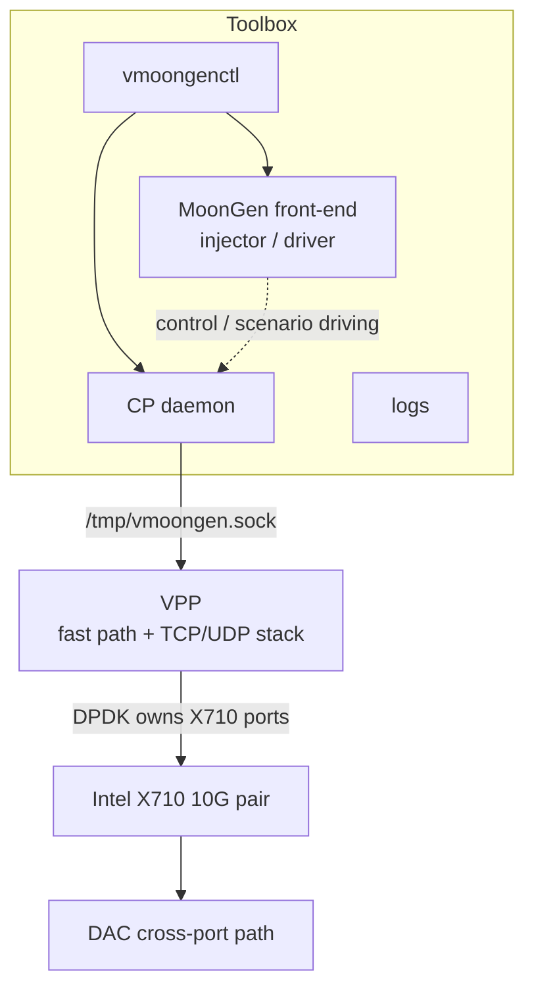
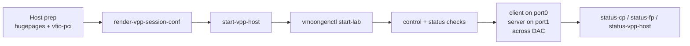

# vMoonGen

vMoonGen is a MoonGen/VPP integration project for high-performance transport and dataplane experimentation.

The current design combines:

- MoonGen + LuaJIT as the front-end experiment driver
- VPP + DPDK as the fast-path transport and packet-processing stack
- a lightweight Python daemon for control-plane orchestration
- shell tooling for host preparation, lifecycle, and observability

The long-term goal is to evolve from a single-host lab into a scalable architecture that can drive large TCP/UDP workloads now, and SCTP later, across distributed front ends and stateful back ends.

## What This Repository Is

This repository is no longer just the original MoonGen codebase.

It is now the working tree for:

- the vMoonGen control-plane integration
- the host/toolbox operating model used on `venus` / `MS-01`
- the DPDK and VFIO preparation flow for the two Intel X710 10G ports
- the MoonGen-side injector and validation scripts around a VPP/DPDK fast path

Some historical MoonGen documentation is still present under [doc/index.md](doc/index.md), but it should be treated as upstream reference material, not as the source of truth for this lab.

## Current Architecture

Current operating model:



Current split of responsibilities:

- Host: hugepages, VFIO, NIC binding, VPP container lifecycle, VPP/DPDK fast path
- Toolbox: `vmoongenctl`, `vpp_bridge_daemon.py`, MoonGen-side experiment driving, logs, diagnostics
- Lua side: thin control client plus fast-path scripts
- Python side: UNIX socket daemon plus VPP backend

Target operating rule for the DAC setup:

- one client role on one X710 port
- one server role on the other X710 port
- traffic must traverse the DAC between ports
- no client/server loop on the same physical port

## Control-Plane Evolution

Current control path:

```text
Lua
  -> UNIX socket
  -> Python daemon
  -> shell out to vppctl
  -> VPP CLI socket
  -> text output
```

Target control path:

```text
Lua
  -> UNIX socket
  -> Python daemon
  -> VPP binary API
  -> structured response
```

Longer-term high-performance target:

```text
Lua / MoonGen
  -> local daemon over UNIX socket
  -> persistent VPP API session
  -> typed requests
  -> optional batching
  -> structured response
```

The high-level architecture stays the same. The backend becomes faster and more structured.

## Current Status

Validated on `venus` on March 17, 2026:

- VPP container reachable through `vppctl`
- persistent control-plane daemon reachable through `/tmp/vmoongen.sock`
- MoonGen runtime dependency check working
- host preflight for hugepages, VFIO, and NIC binding automated
- MoonGen-side workload start working on the X710 pair when the ports are assigned to MoonGen
- VPP dataplane mode detection now refuses to render a broken config when the installed VPP build cannot own the DAC pair

Still in progress:

- on `venus`, the installed VPP `v26.06-rc0` build does not ship `dpdk_plugin.so`; it exposes `ige` / `iavf` / `idpf`, which do not support the X710 PF (`8086:1572`)
- the X710 DAC fast path therefore still requires a VPP rebuild or reinstall with classic DPDK / `net_i40e` support
- current rebuild attempts on `venus` stop earlier in the external dependency chain because `ipsec-mb` needs `nasm`, which is not currently installed in the build environment
- replace the CLI backend with the VPP binary API
- formalize containerized deployment for the full host/toolbox model
- unify Git history and docs between Mac, `venus`, and GitHub
- extend the model toward distributed HBR / L4LB / stateful back ends

## Runtime Automation Model

The current automation model is intentionally script-driven:

- VPP: host-side podman container started by shell scripts with pid/log supervision
- control-plane daemon: script-driven process with socket + pid tracking
- MoonGen-side workload: `nohup` + pid/log files
- lab orchestration: `scripts/vmoongenctl`
- logs: files under `logs/`

Some earlier notes referenced `tmux` and `systemd --user`. Those remain optional operational styles, but they are not the current canonical runtime model of this repository.

## Quick Start

Typical flow on the current single-host lab:

1. Prepare the host:

   ```bash
   scripts/setup-host.sh
   ```

2. Start host-side VPP:

   ```bash
   scripts/vmoongenctl check-vpp-fastpath
   scripts/render-vpp-session-conf.sh
   scripts/start-vpp-host.sh
   ```

3. Start the toolbox control-plane:

   ```bash
   scripts/vmoongenctl start-lab
   ```

4. Check fast-path readiness:

   ```bash
   scripts/vmoongenctl check-fp-ready
   ```

5. Start MoonGen-side workload if needed:

   ```bash
   scripts/vmoongenctl start-fp
   ```

6. Check status:

   ```bash
   scripts/vmoongenctl status-cp
   scripts/vmoongenctl status-fp
   scripts/status-vpp-host.sh
   ```

7. Stop components when needed:

   ```bash
   scripts/vmoongenctl stop-fp
   scripts/vmoongenctl stop-lab
   scripts/stop-vpp-host.sh
   ```

## Lab Workflow



## Key Commands

The main operator entrypoint is:

```bash
scripts/vmoongenctl
```

Useful commands:

- `vmoongenctl render-vpp-conf`
- `vmoongenctl start-lab`
- `vmoongenctl status-cp`
- `vmoongenctl check-fp-deps`
- `vmoongenctl check-fp-ready`
- `vmoongenctl check-vpp-fastpath`
- `vmoongenctl check-vpp-build`
- `vmoongenctl start-fp`
- `vmoongenctl status-fp`
- `vmoongenctl stop-fp`

Command summary:

| Command | Purpose |
| --- | --- |
| `vmoongenctl render-vpp-conf` | render a VPP/DPDK config for the DAC cross-port topology |
| `vmoongenctl start-lab` | start the toolbox control-plane side |
| `vmoongenctl status-cp` | inspect daemon socket and VPP reachability |
| `vmoongenctl check-fp-deps` | check MoonGen runtime libraries |
| `vmoongenctl check-fp-ready` | check host prerequisites plus VPP dataplane support |
| `vmoongenctl check-vpp-fastpath` | detect which VPP dataplane mode is actually available for the DAC NIC pair |
| `vmoongenctl check-vpp-build` | detect missing VPP rebuild prerequisites such as `nasm`, `libdpdk.a`, or `dpdk_plugin.so` |
| `vmoongenctl start-fp` | start the MoonGen-side workload used to drive or validate experiments |
| `vmoongenctl status-fp` | inspect the MoonGen-side workload and recent runtime log |
| `vmoongenctl stop-fp` | stop the MoonGen-side workload and clean DPDK runtime leftovers |

## Observed Footprint On `venus`

Snapshot taken on March 17, 2026 while the control plane was up:

- `vpp_main`: about `350 MiB` RSS and one hot polling core
- `podman` wrapper for the VPP container: about `57 MiB` RSS
- `vpp_bridge_daemon.py`: about `15 MiB` RSS

This is a good memory profile for the current lab, but the idle CPU cost is still one busy VPP main thread.

## Reducing CPU And RAM

Today the safest ways to keep the lab footprint under control are:

- keep the control-plane-only profile when the DAC dataplane is not under test:

  ```bash
  export VMOONGEN_VPP_FASTPATH_MODE=cp-only
  ```

- keep the VPP worker count small:

  ```bash
  export VMOONGEN_VPP_WORKERS=1
  ```

- keep one RX queue and one TX queue per port unless the experiment really needs more:

  ```bash
  export VMOONGEN_VPP_RX_QUEUES=1
  export VMOONGEN_VPP_TX_QUEUES=1
  ```

- keep queue depths modest unless packet loss measurements require deeper buffers:

  ```bash
  export VMOONGEN_VPP_RX_QUEUE_SIZE=512
  export VMOONGEN_VPP_TX_QUEUE_SIZE=512
  ```

- do not start the MoonGen-side workload unless the current test needs it
- for rebuilds on the host, keep `MAKE_PARALLEL_JOBS=4` or lower to avoid wasting CPU time and memory on external dependency builds

Longer term, the biggest CPU reduction on the control side will come from replacing repeated `vppctl` calls with a persistent VPP binary API session in the daemon.

## DAC Validation Checklist

For the current back-to-back DAC setup:

- hugepages configured on the host
- both X710 ports bound to `vfio-pci`
- a VPP session config rendered with DPDK enabled for both ports
- VPP reachable through `cli.sock`
- daemon reachable through `/tmp/vmoongen.sock`
- `vmoongenctl check-fp-ready` passes
- the X710 link is physically up on both ports
- client and server roles are split across the two ports
- traffic crosses the DAC and never loops client/server on the same port

## Configuration

The repository no longer assumes a single hard-coded layout.

Important environment variables:

- `VMOONGEN_ROOT`
- `VPP_ROOT`
- `VMOONGEN_VPP_ROOT`
- `VPP_SOCKET`
- `VPP_CTL_BIN`
- `VMOONGEN_BRIDGE_SOCKET`
- `VMOONGEN_HUGEPAGES`
- `VMOONGEN_VPP_WORKERS`
- `VMOONGEN_VPP_RX_QUEUES`
- `VMOONGEN_VPP_TX_QUEUES`
- `VMOONGEN_VPP_RENDER_CONFIG`
- `VMOONGEN_IFACES`
- `VMOONGEN_NIC1`
- `VMOONGEN_NIC2`

See:

- [scripts/vmoongen-env.sh](scripts/vmoongen-env.sh)
- [tools/vmoongen_env.py](tools/vmoongen_env.py)
- [lua/vmoongen-env.lua](lua/vmoongen-env.lua)

## Documentation Map

Repository rule:

- `README.md` stays at the repository root
- all other maintained Markdown documents live under `doc/`

Project-specific documents:

- [doc/index.md](doc/index.md)
- [doc/architecture.md](doc/architecture.md)
- [doc/control-plane.md](doc/control-plane.md)
- [doc/fast-path.md](doc/fast-path.md)
- [doc/operations.md](doc/operations.md)
- [doc/troubleshooting.md](doc/troubleshooting.md)
- [doc/vpp-integration.md](doc/vpp-integration.md)
- [doc/roadmap.md](doc/roadmap.md)
- [doc/roadmap-control-plane.md](doc/roadmap-control-plane.md)
