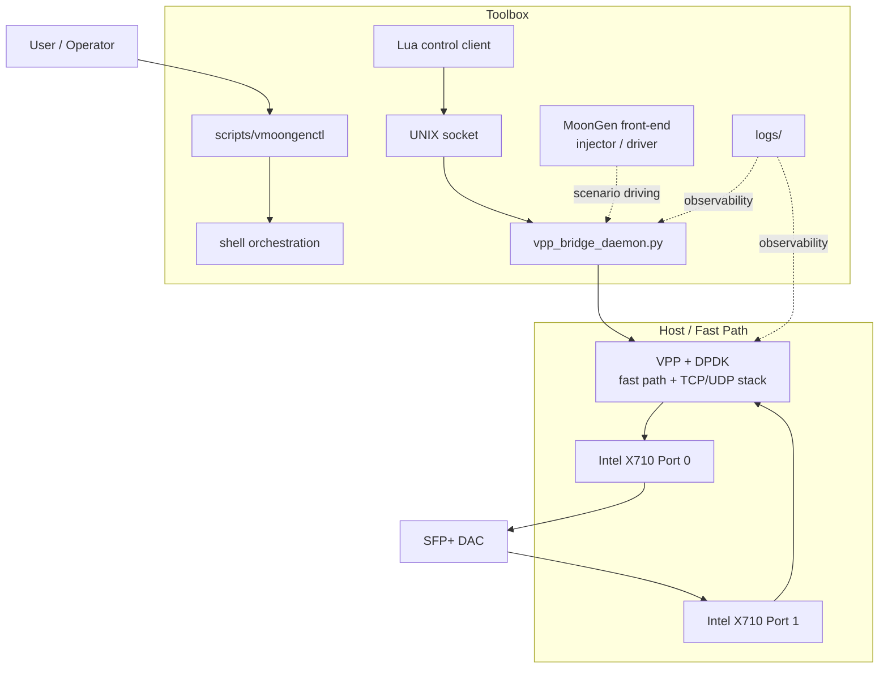
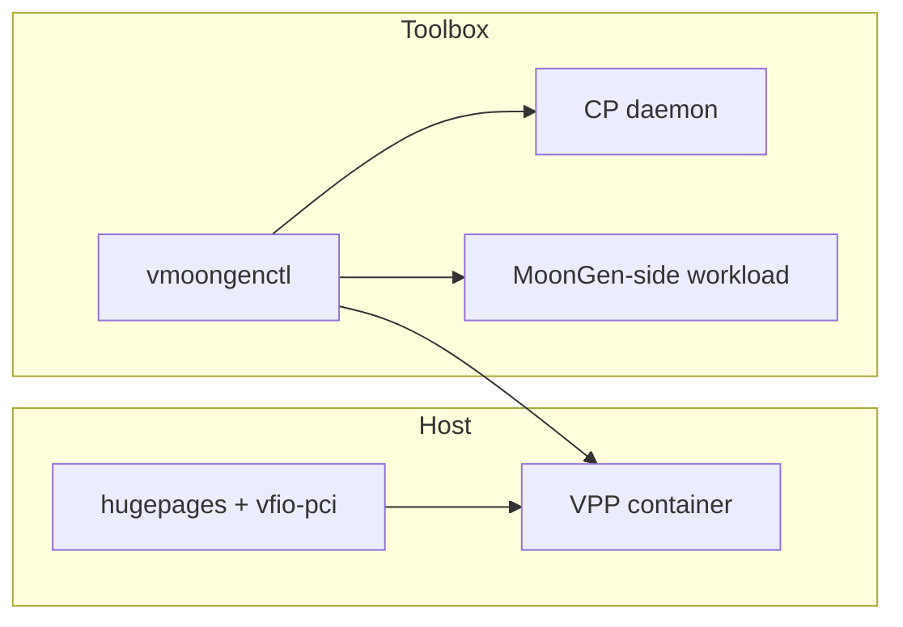
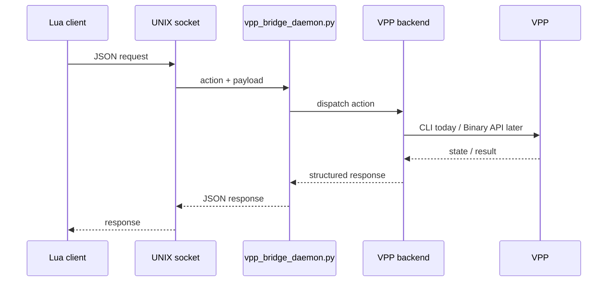
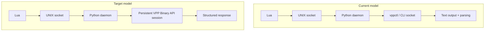
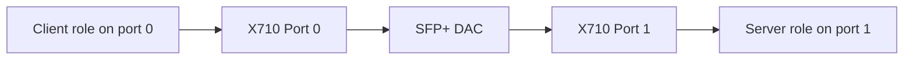
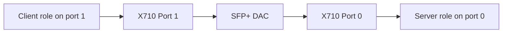
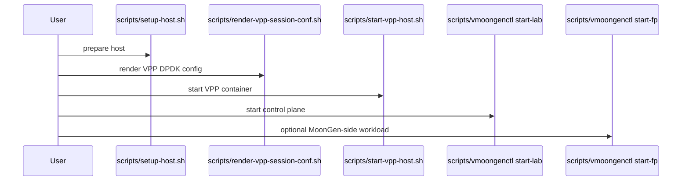

# Lab Architecture Diagram

_Last updated: 2026-03-17_

This document provides a GitHub-rendered overview of the current vMoonGen lab using Mermaid diagrams.

## 1. Full Lab Architecture



## 2. Runtime Model



## 3. Control Plane Request Flow



## 4. Current vs Target Control Plane



## 5. DAC Cross-Port Rule



The reverse direction is equally valid:



Forbidden validation model:

```text
client and server on the same physical port
```

## 6. Typical Start Sequence



## 7. Component Responsibilities

| Component | Responsibility |
| --- | --- |
| VPP + DPDK | transport fast path and packet processing |
| Intel X710 pair | physical dataplane interfaces |
| SFP+ DAC | required cross-port validation path |
| MoonGen / LuaJIT | front-end experiment driving and auxiliary validation |
| `vpp_bridge_daemon.py` | control-plane bridge |
| `vmoongenctl` | unified lab control interface |
| shell scripts | lifecycle automation |
| logs | observability |
